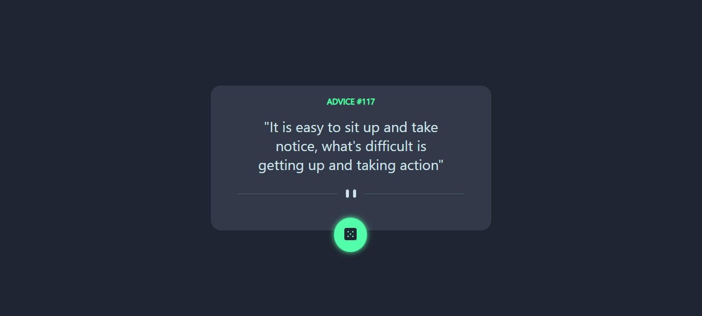

# Frontend Mentor - Advice generator app solution

This is a solution to the [Advice generator app challenge on Frontend Mentor](https://www.frontendmentor.io/challenges/advice-generator-app-QdUG-13db). Frontend Mentor challenges help you improve your coding skills by building realistic projects.

## Table of contents

- [Overview](#overview)
- [The challenge](#the-challenge)
- [Screenshot](#screenshot)
- [Links](#links)
- [My process](#my-process)
- [Built with](#built-with)
- [What I learned](#what-i-learned)
- [Author](#author)
- [Acknowledgments](#acknowledgments)

## Overview

### The challenge

Users should be able to:

- View the optimal layout for the app depending on their device's screen size
- See hover states for all interactive elements on the page
- Generate a new piece of advice by clicking the dice icon

### Screenshot

### Links

- Solution URL: [View solution](https://github.com/Sheriff-Oladimeji/advice-generator-app)
- Live Site URL: [visit site ](https://advice-generator-app-alpha-one.vercel.app/)

### Built with

- Semantic HTML5 markup
- CSS custom properties
- Flexbox
- Desktop-first workflow

## Author

- Github - [Sheriff-Oladimeji](https://github.com/Sheriff-Oladimeji)
- Frontend Mentor - [@OladimejiSheriff](https://www.frontendmentor.io/profile/OladimejiSheriff)
- Twitter - [@SheriffWebDev](https://www.twitter.com/sheriffWebDev)
